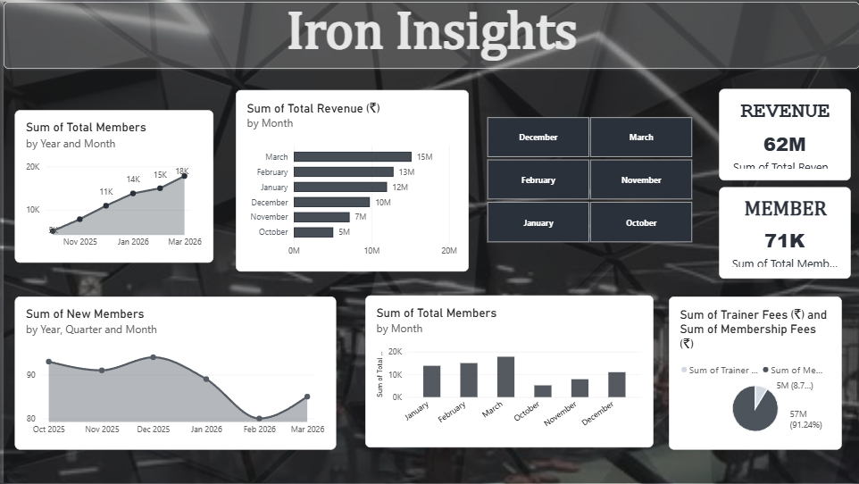
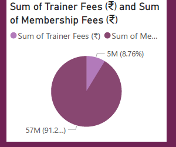
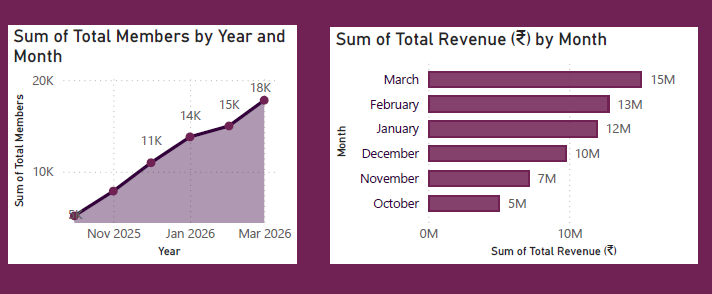
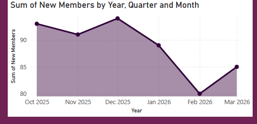
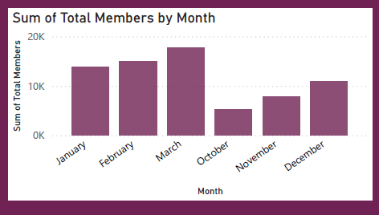
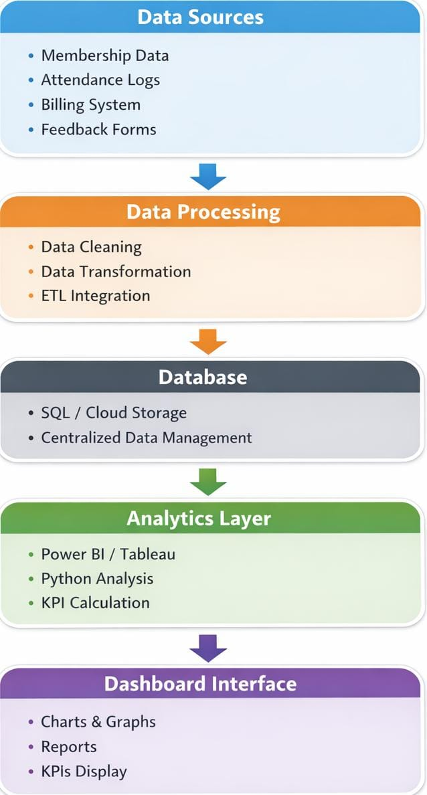
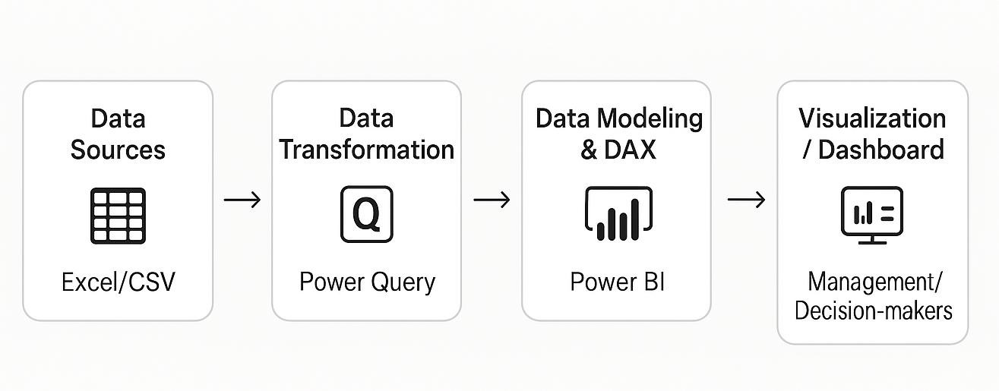

# 🏋️‍♂️ Power Zone: Gym & Fitness Center Business Analytics Dashboard

<div align="center">


**An End-to-End Business Intelligence and Analytics Dashboard for Modern Gym & Fitness Operations**

*Transforming 6 months of granular transactional data into executive KPIs, member acquisition velocity analysis, and multi-stream revenue diagnostics.*

[Explore Dashboards](#-dashboard-previews) • [Business Insights](#-key-business-insights) • [Data Architecture](#-system-architecture--pipeline) • [DAX Measures](#-dax-formulas--measures) • [Setup Guide](#-setup--installation-guide)

---

</div>

<p align="center">
  
</p>

---

## 📑 Table of Contents

- [Executive Summary & Project Overview](#-executive-summary--project-overview)
- [Business Problem & Strategic Objectives](#-business-problem--strategic-objectives)
- [Dashboard Previews](#-dashboard-previews)
  - [View 1: Power Zone (Executive Overview)](#view-1-power-zone--executive-overview-theme)
  - [View 2: Iron Insights (Operational Deep Dive)](#view-2-iron-insights--dark-aesthetic-theme)
  - [Visual Component Deep Dive](#visual-component-deep-dive)
- [Key Business Insights & Analytical Findings](#-key-business-insights--analytical-findings)
- [System Architecture & Data Pipeline](#-system-architecture--data-pipeline)
- [Dataset Architecture & Schema](#-dataset-architecture--schema)
- [Monthly Operational Performance Matrix](#-monthly-operational-performance-matrix)
- [DAX Formulas & Measures Reference](#-dax-formulas--measures-reference)
- [Repository Structure](#-repository-structure)
- [Setup & Installation Guide](#-setup--installation-guide)
- [Technology Stack](#-technology-stack)
- [Author & Academic Acknowledgements](#-author--academic-acknowledgements)

---

## 📌 Executive Summary & Project Overview

The global fitness and commercial wellness industry operates in a high-turnover, competitive environment where business performance hinges on three vital levers: **predictable membership acquisition**, **continuous member retention**, and **diversified high-margin revenue streams (such as Personal Training)**.

Traditional gym facilities frequently suffer from *fragmented data silos*—relying on manual spreadsheets, disconnected POS software, and offline logbooks. This leads to delayed decision-making, unmonitored drop-off rates, and missed revenue optimization opportunities.

The **Power Zone & Iron Insights Business Analytics System** is a full-lifecycle Business Intelligence solution engineered in **Microsoft Power BI**. Spanning **180 days of continuous operational data (October 2025 to March 2026)**, the dashboard ingests, models, and visualizes essential operational metrics. It tracks the facility's rapid expansion from **122 to 652 active members (+434.4% growth)**, analyzing **₹61.98M (~₹62M)** in gross turnover.

```
       180 Days                    ₹61.98M                     652 Active                  532 Signups
  [October 2025 – March 2026]   [Total Gross Revenue]    [Ending Active Members]     [Total New Members]
```

---

## 🎯 Business Problem & Strategic Objectives

### The Problem Statement
- **Lack of Centralized Reporting:** Facility management struggled to see real-time correlation between new client acquisition and daily gross income.
- **Revenue Stream Blindspots:** Difficulty in quantifying the exact financial ratio between flat recurring subscription fees versus high-yield personal trainer commissions.
- **Operational Planning Gaps:** Inability to pinpoint monthly velocity trends, leading to reactive equipment maintenance and staff scheduling.

### Project Objectives
1. **Track Member Growth & Retention:** Deliver an interactive timeline visualizing active members and monthly acquisition rates.
2. **Deconstruct Revenue Composition:** Measure the precise split between base membership fees and personal trainer bookings.
3. **Equip Management with Dynamic Filters:** Provide intuitive multi-month matrix slicers for instant slice-and-dice data exploration.
4. **Deliver Dual-Themed UX:** Create both an **Executive Overview (Power Zone)** tailored for leadership briefings and a **Dark Mode (Iron Insights)** tailored for operational floor displays.

---

## 🖥️ Dashboard Previews

### View 1: Power Zone — Executive Overview Theme

> **High-contrast executive layout designed for boardroom reviews and high-level decision support.**

<p align="center">
  
</p>

#### Dashboard Highlights:
- **Macro KPI Scorecards:** Prominent indicators highlighting cumulative **₹62M Gross Revenue** and **71K Member-Day Volume**.
- **Active Member Expansion Curve:** Shaded area line chart displaying steady growth from 5K cumulative member-days in Oct 2025 up to 18K in Mar 2026.
- **Monthly Revenue Trajectory:** Horizontal bar chart illustrating revenue expansion from ₹5M in October to ₹15M in March.
- **Interactive Matrix Slicer:** Fast toggle filter across October, November, December, January, February, and March.
- **Revenue Stream Donut Breakdown:** Visual representation of Membership Fees (91.24%) vs Personal Trainer Fees (8.76%).

---

### View 2: Iron Insights — Dark Aesthetic Theme

> **Sleek, modern dark-mode aesthetic incorporating the gym facility's geometric interior branding for operational floor command.**

<p align="center">
  
</p>

#### Key Advantages:
- Reduced eye fatigue for front-desk and gym management terminal monitors.
- Elevated visual contrast on critical drop-off points and acquisition spikes.
- Elegant card overlays matching modern fitness brand aesthetics.

---

### Visual Component Deep Dive

<div align="center">

| Revenue Stream Breakdown | Monthly Revenue & Member Trajectory |
| :---: | :---: |
|  |  |
| **Membership Fees (91.24%) vs Trainer Fees (8.76%)** | **Compounding Revenue from ₹5M to ₹15M/month** |

| New Member Acquisition Velocity | Monthly Active Member Distribution |
| :---: | :---: |
|  |  |
| **Monthly intake ranging between 80 to 94 signups** | **Progression across Q4 2025 and Q1 2026** |

</div>

---

## 📈 Key Business Insights & Analytical Findings

Through interactive exploration and DAX modeling, several critical strategic patterns were uncovered:

### 1. Compounding Revenue Scalability
- **300% Monthly Top-Line Growth:** Gross monthly income increased threefold from **₹5.07M in October 2025** to **₹15.15M in March 2026**.
- **Subscription Predictability:** Membership subscription revenue formed the financial backbone, generating **₹56,547,200 (91.24%)** across the 6-month period.

### 2. High-Growth Member Base Expansion
- The active gym membership expanded from **122 members on Day 1** to **652 members by Day 180**, representing a net surge of **+434.4%**.
- A total of **532 new members** joined during this timeline with virtually zero churn slippage, showing strong initial retention.

### 3. Personal Trainer Monetization Potential
- Personal Training generated **₹5,429,976 (8.76%)** in top-line fees.
- *Strategic Takeaway:* Trainer fees represent an untapped upsell vector. Because trainer revenue remained relatively flat (~₹825K – ₹990K per month) while active members quadrupled, introducing bundled training packages will substantially boost overall yield.

### 4. Seasonality & Sign-up Velocity
- Signups peaked in **December (94 signups)** and **October (93 signups)**.
- While February had fewer calendar days (28 days) resulting in 80 signups, daily velocity rebounded strongly in March with 85 signups (+6.25% MoM).

---

## 🏗️ System Architecture & Data Pipeline

The project follows a standard multi-tier Business Intelligence lifecycle:

<p align="center">
  
  &nbsp;&nbsp;&nbsp;&nbsp;
  
</p>

### Pipeline Phases:
1. **Data Sources (Ingestion):** Granular daily transactions collected in Microsoft Excel (`gym_dashboard_6_months.xlsx`), capturing 180 continuous operational log records.
2. **Data Transformation (Power Query ETL):**
   - Standardized date data types (`YYYY-MM-DD`).
   - Cleaned null/blank anomalies and removed extraneous artifacts.
   - Formatted currency values in Indian Rupees (₹) with numeric precision.
   - Performed mathematical validation ensuring `Total Revenue = Membership Fees + Trainer Fees`.
3. **Data Modeling & DAX Calculation Engine:** Built centralized measures using Power BI DAX to calculate running totals, proportions, and averages.
4. **Presentation & Visualization Layer:** Engineered multi-layered interactive dashboards with cross-filtering, tooltips, custom palette design, and responsive slicers.

---

## 🗃️ Dataset Architecture & Schema

The underlying dataset comprises **180 daily records** logged across 6 consecutive months:

| Column Name | Data Type | Description | Sample Value |
| :--- | :--- | :--- | :--- |
| `Date` | Date | Transaction record date (`YYYY-MM-DD`) | `2025-10-01` |
| `Month` | Text | Name of the calendar month | `October` |
| `Total Members` | Whole Number | Cumulative count of active members | `122` |
| `New Members` | Whole Number | New member registrations on that date | `2` |
| `Membership Fees (₹)` | Decimal / Currency | Base subscription collections | `₹97,600` |
| `Trainer Fees (₹)` | Decimal / Currency | Add-on personal trainer booking collections | `₹22,032` |
| `Total Revenue (₹)` | Decimal / Currency | Gross revenue generated (`Membership + Trainer`) | `₹119,632` |

---

## 📊 Monthly Operational Performance Matrix

Here is the month-by-month financial and operational breakdown calculated from the dataset:

| Month | Days Logged | Starting Members | Ending Members | New Signups | Membership Fees (₹) | Trainer Fees (₹) | Total Revenue (₹) | % of Total Rev |
| :--- | :---: | :---: | :---: | :---: | :---: | :---: | :---: | :---: |
| **October 2025** | 31 | 122 | 213 | 93 | ₹4,150,400 | ₹917,678 | **₹5,068,078** | 8.18% |
| **November 2025** | 30 | 218 | 304 | 91 | ₹6,312,800 | ₹853,510 | **₹7,166,310** | 11.56% |
| **December 2025** | 31 | 305 | 398 | 94 | ₹8,792,000 | ₹990,728 | **₹9,782,728** | 15.78% |
| **January 2026** | 31 | 403 | 487 | 89 | ₹11,048,000 | ₹938,812 | **₹11,986,812** | 19.34% |
| **February 2026** | 28 | 492 | 567 | 80 | ₹12,000,800 | ₹824,670 | **₹12,825,470** | 20.69% |
| **March 2026** | 29 | 569 | 652 | 85 | ₹14,243,200 | ₹904,578 | **₹15,147,778** | 24.44% |
| **Grand Total** | **180** | **122** | **652** | **532** | **₹56,547,200** | **₹5,429,976** | **₹61,977,176** | **100.0%** |

---

## 🔢 DAX Formulas & Measures Reference

Key Data Analysis Expressions (DAX) engineered to support the visualizations:

### 1. Gross Revenue
```dax
Total Revenue = SUM('Gym Dashboard Data'[Total Revenue (₹)])
```
*Aggregates overall gross turnover across all filtered operational days.*

### 2. Base Membership Subscription Fees
```dax
Total Membership Fees = SUM('Gym Dashboard Data'[Membership Fees (₹)])
```
*Measures core subscription income.*

### 3. Personal Trainer Income
```dax
Total Trainer Fees = SUM('Gym Dashboard Data'[Trainer Fees (₹)])
```
*Quantifies personal trainer specialized booking fees.*

### 4. Cumulative New Signups
```dax
Total New Members = SUM('Gym Dashboard Data'[New Members])
```
*Calculates the total influx of newly acquired fitness club members.*

### 5. Active Membership Capacity
```dax
Closing Active Members = MAX('Gym Dashboard Data'[Total Members])
```
*Retrieves the peak active headcount for any selected reporting interval.*

### 6. Revenue Stream Proportions
```dax
Trainer Fee Contribution % = 
DIVIDE(
    [Total Trainer Fees],
    [Total Revenue],
    0
)
```
```dax
Membership Fee Contribution % = 
DIVIDE(
    [Total Membership Fees],
    [Total Revenue],
    0
)
```
*Computes dynamic percentage contributions (8.76% and 91.24% benchmarked).*

---

## 📁 Repository Structure

```tree
Gym_and_Fitness_Dashboard/
│
├── Power_Zone_Fitness_Dashboard.pbix   # Primary Power BI Desktop Report & Models
├── README.md                           # Documentation & Visual Guide
├── .gitattributes                      # Git LFS & line ending attributes
│
├── data/
│   └── gym_dashboard_6_months.xlsx     # Cleaned 6-month operational dataset
│
└── assets/                             # High-resolution screenshots & diagrams
    ├── gym_hero_banner.jpg             # Header showcase banner
    ├── power_zone_dashboard.png        # View 1: Executive Overview Dashboard
    ├── iron_insights_dashboard.png     # View 2: Operational Dark Theme Dashboard
    ├── system_architecture.jpeg        # Full System Architecture Diagram
    ├── data_pipeline_workflow.jpeg     # End-to-End ETL Data Pipeline
    ├── chart_fee_distribution_donut.png# Donut chart: Revenue breakdown
    ├── chart_revenue_members_trend.png # Trend: Members & Revenue growth
    ├── chart_new_members_trend.png     # Velocity: New monthly signups
    └── chart_members_monthly_bar.png   # Volume: Monthly member distribution
```

---

## 🚀 Setup & Installation Guide

### Prerequisites
- **Microsoft Power BI Desktop** (Recommended: Version 2.126 or newer)
- **Microsoft Excel** (or compatible spreadsheet software)

### Steps to Run Locally:
1. **Clone the Repository:**
   ```bash
   git clone https://github.com/akashdeekshi-sudo/Gym_and_Fitness_Dashboard.git
   cd Gym_and_Fitness_Dashboard
   ```

2. **Open the Power BI Project:**
   - Double-click `Power_Zone_Fitness_Dashboard.pbix` (or open Power BI Desktop and choose **File > Open**).

3. **Verify Data Source Connection:**
   - If prompted for dataset location, go to:
     `Home` > `Transform Data` > `Data source settings`
   - Browse and select `data/gym_dashboard_6_months.xlsx`.
   - Click **Apply Changes** to refresh the visual canvas.

4. **Interact with the Dashboard:**
   - Click month names in the slicer to filter metrics by period.
   - Toggle between the **Power Zone** and **Iron Insights** report tabs.

---

## 🛠️ Technology Stack

- **Analytics & BI Platform:** Microsoft Power BI Desktop
- **Data Querying & ETL:** Power Query M Language
- **Calculation Modeling:** DAX (Data Analysis Expressions)
- **Data Storage & Pipeline:** Microsoft Excel (`.xlsx`)
- **Version Control & Documentation:** Git, GitHub, Markdown

---

## 👥 Author & Academic Acknowledgements

**Project Lead & Developer:**
- **Akash G** — *Reg. No: 44111152*  
  Department of Computer Science and Engineering  
  School of Computing  
  **Sathyabama Institute of Science and Technology** (Deemed to be University), Chennai, India.

**Project Guide:**
- **Dr. A. P. Narmadha** — *Department of Computer Science and Engineering*

Special thanks to the faculty, reviewers, and technical staff at the Department of Computer Science and Engineering for their continuous feedback and guidance throughout this project.

---
